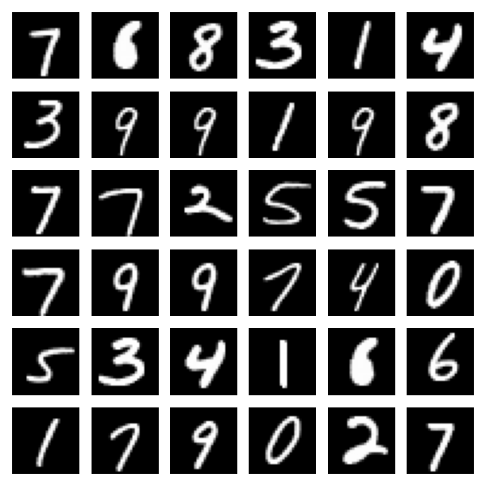
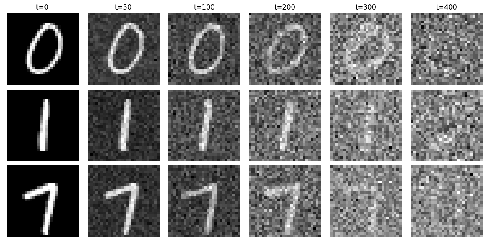

# Physics-Aware Diffusion Models

This project develops energy-based diffusion models for generating molecular configurations. These models can potentially reduce or replace computationally expensive molecular dynamics simulations.

## Problem Statement

Current diffusion models for molecular systems face several challenges:

- **Training instability** and high computational cost during inference
- **Expensive trajectory generation** - each configuration requires a full reverse diffusion process
- **Physical inconsistencies** - the learned score function often violates the Fokker-Planck equation at near-zero diffusion times, producing correct equilibrium distributions but incorrect dynamics

While enforcing Fokker-Planck consistency during training improves physical validity, it adds significant computational overhead.

## Our Approach

We combine two key techniques:

1. **Selective Fokker-Planck regularization** - We treat Fokker-Planck consistency as a diagnostic constraint, enforcing it only when violations exceed a threshold
2. **Energy-consistent distillation** - We compress the physically consistent model into a fast sampling scheme

This approach reduces computational complexity while maintaining both thermodynamic accuracy and correct dynamics.

## Key Features

- Energy-parameterized diffusion models
- Adaptive Fokker-Planck regularization via residual gating
- Distillation into normalizing flows
- Evaluation via force error and Langevin stability metrics

## Progress

### Phase 1: Core Diffusion Model ✓

We have implemented and tested the fundamental components of a variance-preserving SDE diffusion model:

- [Forward process](https://github.com/LoqmanSamani/physics_aware_diffusion/blob/systembiology/diffusion/forward.py) - adds noise to data
- [Reverse process](https://github.com/LoqmanSamani/physics_aware_diffusion/blob/systembiology/diffusion/reverse.py) - generates samples
- [Variance scheduler](https://github.com/LoqmanSamani/physics_aware_diffusion/blob/systembiology/diffusion/schedules.py) - controls noise levels over time

All components include [unit tests](https://github.com/LoqmanSamani/physics_aware_diffusion/tree/systembiology/tests/diffusion_tests) to ensure correctness.

### Validation Experiment

To verify our implementation, we trained a diffusion model on the [MNIST dataset](https://docs.pytorch.org/vision/main/generated/torchvision.datasets.MNIST.html). This lightweight experiment uses:

- A [UNet-based architecture](https://github.com/LoqmanSamani/physics_aware_diffusion/blob/systembiology/score_nets/tiny_unet.py) with attention mechanism as the score network
- Custom [training algorithm](https://github.com/LoqmanSamani/physics_aware_diffusion/blob/systembiology/trainers/diffusion_trainer.py)
- DDPM-style [sampling algorithm](https://github.com/LoqmanSamani/physics_aware_diffusion/blob/systembiology/samplers/diffusion_sampler.py)

**Results:**

<div align="center">
  
  <br>
  <em>Samples generated by our trained model</em>
  <br><br>
</div>

<div align="center">
  
  <br>
  <em>Three samples shown at different time steps during the sampling process</em>
  <br><br>
</div>

The results confirm that our core implementation works correctly.

### Next Steps

Phase 2 will focus on implementing and integrating the Fokker-Planck components into the diffusion model, followed by testing on molecular systems.

## Repository Structure
```bash
physics_aware_diffusion/
│
├── README.md
├── requirements.txt
├── setup.py                      
│
├── configs/
│   ├── base.yaml                  # shared hyperparameters
│   ├── diffusion_vp.yaml
│   ├── diffusion_ve.yaml
│   ├── fp_regularization.yaml
│   ├── distillation.yaml
│
├── data/
│   ├── raw/
│   │   ├── toy_gaussians.py
│   │   ├── double_well.py
│   │   ├── muller_brown.py
│   │   └── md_small_system.npz
│   │
│   ├── processed/
│   │   ├── toy_2d.npz
│   │   └── muller_brown.npz
│   │
│   └── loaders.py
│
├── models/
│   ├── __init__.py
│   │
│   ├── energy/
│   │   ├── energy_net.py          # E_theta(x, t)
│   │   ├── time_embedding.py
│   │   └── __init__.py
│   │
│   ├── score/
│   │   ├── energy_net.py            # alternative to energy form
│   │   └── __init__.py
│   │
│   ├── flow/
│   │   ├── realnvp.py
│   │   ├── coupling.py
│   │   ├── base_distribution.py
│   │   └── __init__.py
│   │
│   └── utils.py                   # weight init, helpers
│
├── diffusion/
│   ├── __init__.py
│   ├── sde.py                     #SDE definitions
│   ├── schedules.py               # beta(t), sigma(t)
│   ├── forward.py                 # x0 -> xt
│   ├── reverse.py                 # sampling
│   └── probability_flow.py
│
├── physics/
│   ├── __init__.py
│   ├── fokker_planck.py            # FP operator & residual
│   ├── divergence.py               # Hutchinson estimator
│   ├── gating.py                   # adaptive alpha(x,t)
│   └── energies.py                 # energy/force utilities
│
├── losses/
│   ├── __init__.py
│   ├── dsm.py                      # denoising score matching
│   ├── fp_loss.py                  # adaptive FP loss
│   ├── distillation.py
│   └── regularizers.py
│
├── trainers/
│   ├── __init__.py
│   ├── diffusion_trainer.py
│   ├── fp_diffusion_trainer.py
│   ├── distillation_trainer.py
│   └── callbacks.py
│
├── evaluation/
│   ├── __init__.py
│   ├── sampling.py
│   ├── langevin.py
│   ├── free_energy.py
│   ├── force_error.py
│   └── metrics.py
│
├── experiments/
│   ├── toy_2d/
│   │   ├── train_baseline.py
│   │   ├── train_fp_adaptive.py
│   │   ├── distill_flow.py
│   │   └── eval.py
│   │
│   ├── muller_brown/
│   │   ├── train_fp.py
│   │   ├── distill.py
│   │   └── eval.py
│   │
│   └── md_small/
│       ├── train_fp.py
│       └── eval.py
│
├── scripts/
│   ├── preprocess_data.py
│   ├── sample_diffusion.py
│   ├── sample_flow.py
│   └── run_experiment.sh
│
├── notebooks/
│   ├── fp_residual_analysis.ipynb
│   ├── energy_landscape.ipynb
│   ├── force_visualization.ipynb
│   └── distillation_comparison.ipynb
│
├── checkpoints/
│   ├── diffusion/
│   └── flow/
│
├── results/
│   ├── figures/
│   ├── logs/
│   └── tables/
│
└── tests/
    ├── test_sde.py
    ├── test_fp_residual.py
    ├── test_energy_grad.py
    └── test_flow_logp.py
```


